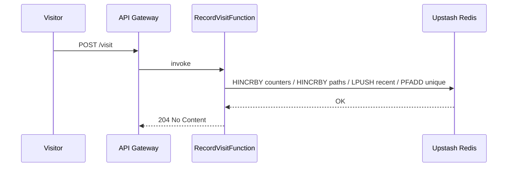

# Architecture

## Overview

The dashboard is a fully serverless system. Visits are recorded through a REST
API and rendered in a static web dashboard served from S3.

## Components

| Component | Responsibility |
| --- | --- |
| Tracking snippet (JS) | Sends visit beacons to the API via `navigator.sendBeacon` |
| API Gateway | Exposes the REST API over HTTPS |
| `RecordVisitFunction` (Lambda) | Writes visit data to Redis |
| `GetStatsFunction` (Lambda) | Reads aggregated stats for the dashboard |
| `AggregateStatsFunction` (Lambda) | Scheduled rollup of daily/weekly statistics |
| Upstash Redis | Serverless data store (counters, series, paths, recent visits) |
| S3 | Hosts the static dashboard |

## Data Flow

### Recording a visit

1. Visitor loads a tracked page. The tracking snippet sends `POST /visit`.
2. API Gateway routes the request to `RecordVisitFunction`.
3. The Lambda extracts IP, User-Agent, path, and timestamp.
4. It writes to Redis (4 commands):
   - `HINCRBY counter:hour:{yyyyMMdd} <HH> 1`
   - `HINCRBY paths:day:{yyyyMMdd} <path> 1`
   - `LPUSH visits:recent <visit-json>` (trimmed periodically by the aggregator)
   - `PFADD visitors:unique:day:{yyyyMMdd} <ip|ua>`

### Reading the dashboard

1. Browser loads the S3-hosted dashboard.
2. Dashboard calls `GET /stats/*`.
3. `GetStatsFunction` reads Redis and returns JSON.
4. Chart.js renders the data.

### Aggregation

- `AggregateStatsFunction` runs daily at 00:00 UTC via EventBridge.
- It rolls the previous (completed) day's hourly counters into daily buckets and
  daily buckets into weekly totals, and prunes expired keys.

## Sequence

## Deployment Topology

- Single AWS region.
- Two request-handling Lambda functions (`RecordVisitFunction`,
  `GetStatsFunction`) behind one API Gateway.
- One scheduled Lambda (`AggregateStatsFunction`).
- One Upstash Redis database in a region close to the Lambda.
- One S3 bucket for static hosting (optionally fronted by CloudFront).

